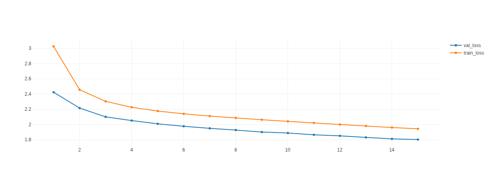

# Chess-Engine-with-Transformers
## Dataset
[Lichess/tournament-chess-games](https://huggingface.co/datasets/Lichess/tournament-chess-games) on HuggingFace

Filtered it to get games with:

1. Variant == "Standard"

2. WhiteElo >= 2500

3. BlackElo >= 2500

Processed movetext to be in the following form:

    "Turn King_side_castling_rights Queen_side_castling_rights piece_on_a1 piece_on_a2 ... piece_on_h8"

Example input:

    "BLACK NO_KINGSIDE_CASTLE NO_QUEENSIDE_CASTLE R N B Q K B EMPTY R P P P P EMPTY P P P EMPTY EMPTY EMPTY EMPTY EMPTY N EMPTY EMPTY EMPTY EMPTY EMPTY EMPTY P EMPTY EMPTY EMPTY EMPTY EMPTY p EMPTY EMPTY EMPTY EMPTY EMPTY EMPTY EMPTY EMPTY EMPTY EMPTY EMPTY EMPTY EMPTY p p EMPTY p p p p p r n b q k b n r"

Example output:

    "b8c6"

Splitted the dataset into 75% train and 25% test

more details in data.ipynb

## Transformer

Encoder-only transformer with following design:

        num_hidden_layers = 4
        num_attention_heads = 4
        max_position_embeddings = 68
        vocab_size = 20
        hidden_size = 128
        intermediate_size = 512
        num_classes = 66
        embedd_dropout = 0.1
        head_dropout = 0.1
        multi_dropout = 0.1
        FF_dropout = 0.1
        classifier_dropout = 0.2

Model takes board's state as input and outputs two distributions one for start_square and one for end_square

Both distributions are over 66 classes 64 for board's squares, 1 for King_side_castling and 1 for Queen_side_castling

more details in architecture.py

## Training
Trained on GTX970 took 14 hours

Trained on the following arguments:

    batch_size = 128
    gradient_accumulation_steps = 1
    epochs = 15
    lr = 8e-4
    warmup = 10%

[CLS] token is added to the input which is projected onto the 66 classes at the end of the encoder

Losses of the start_square and end_square are averaged

more details in train.py and mlruns

## Play against the model

run
    
    git clone https://github.com/n-zalok/Chess-Engine-with-Transformers.git &&
    cd Chess-Engine-with-Transformers &&
    chmod +x play.sh &&
    ./play.sh

then choose your side by clicking on the color

The score the model gives to its last move and the time it took to make that move is outputted in red at the top of the screen

The model although it does not play randomly it is still naive and could be beaten easliy by a human

more details in pipe.py

