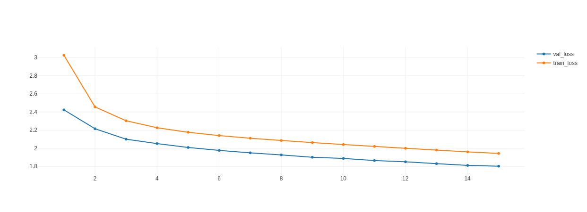

# Chess Engine with Transformers

A transformer-based chess move prediction system that learns from high-level tournament games and lets you play against the resulting model through an interactive Pygame interface.

## Overview

This project explores a simple but interesting question: **can a Transformer learn to suggest chess moves directly from a representation of the current board position?**

Rather than using a traditional chess engine with hand-crafted evaluation functions and search algorithms, this project treats move selection as a **supervised learning problem**. A custom encoder-only Transformer receives a tokenized representation of the board state and predicts where a move starts and where it ends.

The project covers the full machine learning workflow:

- Collecting and filtering real-world chess data
- Cleaning and parsing chess games
- Converting games into board-position → move training examples
- Designing and implementing a custom Transformer from scratch
- Using a multi-head classification approach to predict moves
- Training and evaluating the model
- Constraining predictions to legal chess moves
- Building an interactive interface for playing against the model

---

## How It Works

At each turn, the model receives the **current state of the chessboard** and predicts the next move.

Instead of representing the board as an image, the chess position is represented as a sequence of tokens. This allows the problem to be approached similarly to other sequence-based machine learning tasks.

For example, an input contains:

- The side to move
- King-side castling rights
- Queen-side castling rights
- The piece occupying each of the 64 squares

Example:

```text
BLACK NO_KINGSIDE_CASTLE NO_QUEENSIDE_CASTLE
R N B Q K B EMPTY R
P P P P EMPTY P P P
EMPTY EMPTY EMPTY EMPTY EMPTY N EMPTY EMPTY
EMPTY EMPTY EMPTY EMPTY EMPTY EMPTY P EMPTY
EMPTY EMPTY EMPTY EMPTY EMPTY p EMPTY EMPTY
EMPTY EMPTY EMPTY EMPTY EMPTY EMPTY EMPTY EMPTY
EMPTY EMPTY EMPTY EMPTY EMPTY EMPTY p p
EMPTY p p p p p p p
r n b q k b n r
```

The target is the next move, for example:

```text
b8c6
```

---

# Dataset & Data Pipeline

## Source Data

The project uses the [Lichess Tournament Chess Games dataset](https://huggingface.co/datasets/Lichess/tournament-chess-games) from Hugging Face.

To focus the model on high-quality chess, the dataset was filtered to include only games where:

- The variant is **Standard chess**
- White's Elo rating is **2500 or higher**
- Black's Elo rating is **2500 or higher**

This creates a dataset of moves played by strong chess players rather than attempting to learn from games of arbitrary skill levels.

## Cleaning the Game Data

The original game records contain movetext with additional notation such as comments, annotations, and formatting artifacts. Before parsing the games, the movetext was cleaned by:

- Removing comments enclosed in `{...}`
- Removing move annotations such as `?` and `!`
- Removing Black move-number notation such as `1...`
- Normalizing whitespace

The cleaned games can then be processed using standard chess tooling and notation.

## From Games to Training Examples

A single chess game contains many useful training examples. Rather than treating an entire game as one sample, the data pipeline replays each game move by move.

For every position:

1. Start from the initial chessboard.
2. Replay moves sequentially.
3. Capture the current board state **before** the next move.
4. Record the move that was actually played.
5. Convert the board state and move into a supervised training example.

This transforms tournament games into a dataset of:

```text
Current board position → Next move
```

The processed dataset was uploaded to Hugging Face for easier reuse and access.

The final dataset was split into:

- **75% training data**
- **25% test data**

For more details, see [`data.ipynb`](./data.ipynb).

---

# Model Architecture

## Encoder-Only Transformer

The model uses a custom **encoder-only Transformer** architecture.

The input is a sequence describing the board state, and the Transformer learns contextual relationships between:

- Pieces and their positions
- The side to move
- Castling rights
- The overall configuration of the board

A `[CLS]` token is added to the beginning of every input sequence. After passing through the Transformer encoder, the final representation of this token is used as a pooled representation of the entire chess position.

### Architecture Configuration

```text
num_hidden_layers       = 4
num_attention_heads     = 4
max_position_embeddings = 68
vocab_size              = 20
hidden_size             = 128
intermediate_size       = 512
num_classes             = 66
embedding_dropout       = 0.1
attention_dropout       = 0.1
feed_forward_dropout    = 0.1
classifier_dropout      = 0.2
```

---

## Predicting a Move with Two Classification Heads

A chess move naturally contains two components:

1. **Where the move starts**
2. **Where the move ends**

Instead of predicting every possible move as a single class, the model uses a **shared Transformer encoder with two classification heads**:

- `start_head` predicts the starting square
- `end_head` predicts the destination square

Both heads operate on the same pooled `[CLS]` representation:

```text
Board representation
        ↓
Transformer Encoder
        ↓
   [CLS] representation
      ↙       ↘
Start Head   End Head
```

Each head predicts a distribution over **66 classes**:

- 64 classes for the squares on the chessboard
- 1 class for king-side castling
- 1 class for queen-side castling

The encoder is shared, meaning that gradients from both prediction tasks contribute to learning the underlying board representation.

The training objective averages the losses from the two heads, allowing the model to jointly learn the origin and destination of a move.

For implementation details, see [`architecture.py`](./architecture.py).

---

# Training

The model was trained on an **NVIDIA GTX 970**, with training taking approximately **14 hours**.

### Training Configuration

```text
batch_size                  = 128
gradient_accumulation_steps = 1
epochs                      = 15
learning_rate               = 8e-4
warmup                      = 10%
```

During training, the loss from the start-square classifier and end-square classifier is averaged and backpropagated through the shared Transformer.

### Training Loss



Additional training details and experiment tracking can be found in:

- [`train.py`](./train.py)
- `mlruns/`

---

# From Predictions to Legal Chess Moves

Predicting a starting square and destination independently introduces an important challenge:

> The most likely start square and the most likely end square do not necessarily form a legal chess move.

For example, independently selecting the highest-probability prediction from each head may produce a move that is impossible in the current position.

To solve this, the inference pipeline combines the predictions from both heads and searches for the **highest-scoring legal move**.

Conceptually, the pipeline:

1. Generates candidate combinations of start and end predictions.
2. Scores candidates using the probabilities assigned by both classification heads.
3. Checks whether each candidate is legal in the current chess position.
4. Selects the highest-scoring valid move.

This allows the neural network to focus on learning move preferences while the chess rules are used as a constraint during inference.

Castling is handled through the two additional classes. A castling move is selected when the corresponding castling class is predicted for both components of the move.

For more details, see [`pipe.py`](./pipe.py).

---

# Play Against the Model

The project includes an interactive **Pygame interface** that allows you to play chess against the trained model.

After each human move, the model:

1. Receives the updated board position.
2. Predicts and validates its next move.
3. Plays the highest-scoring legal move.

The interface also displays information about the model's decision, including:

- The score/probability assigned to the selected move
- The time required to generate the move, in milliseconds

## Run Locally

```bash
git clone https://github.com/n-zalok/Chess-Engine-with-Transformers.git
cd Chess-Engine-with-Transformers
chmod +x play.sh
./play.sh
```

Then choose your side by clicking on the desired color and start playing.

> **Note:** This is a learned move-prediction model rather than a search-based chess engine such as Stockfish. It does not play randomly, but it is still a relatively small and naive model and can be beaten by a human player.

---